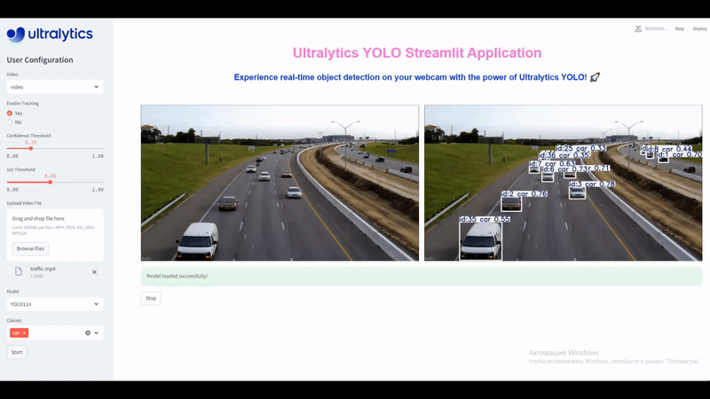

# Детекция движущихся автомобилей с помощью модели YOLOv11

## 📌 Описание проекта
В рамках данного проекта было решено 3 задачи:
- Подготовить датасет с jpg-фото и результатами разметки для обучения модели yolo;
- Развернуть модель YOLOv11 в streamlit для определения расположения движущихся легковых автомобилей;
- Использовать возможности модуля solutions от Ultralytics для оценки скорости движения автомобилей.

💻 Стек технологий: cv2, ultralytics, YOLOv11, streamlit.

## 📚 Исходные данные
Для первой задачи датасет взят из [Kaggle.](https://www.kaggle.com/code/moemnelhalose/car-objcet-detection-yolo8/input) 

Он включает в себя 
- 1001 JPG-изображение в тренировочном наборе,
- 175 в тестовом,
- csv-файл с результатами разметки: координаты bboxoв (xmin, ymin, xmax, ymax) и название соответствующего изображения.

Видео для 2й и 3й задач взяты из открытых источников.

**Пример работы детектора YOLOv11:**



**Пример работы определения скорости с помощью YOLO:**


## Пример запуска скрипта для оценки скорости

Клонировать тот репозиторий.
Из терминала или командной строки, запусти скрипт, используя следующую команду: 
```{python}
python car_speed_estimation.py
```

## Выводы
Обученная модель отлично отрабатывает на изображениях из тестового набора, но на видео, особенно плохого качества определяются не все машины. Исходная предобученная модель YOLOv11n на видео отрабатывает лучше, чем обученная на датасете с картинками.

❗ Для повышения качества детекции на видео необходимо увеличить тренировочный датасет, а именно, обучать на видео и добавить аугментацию.

Ограничениями использования моделей компьютерного зрения для задач определения скорости являются:
- плохие погодные условия и качество освещения могут значительно сказываться на качестве работы;
- большие вычислительные мощности, требуемые для обработки большого количества данных в единицу времени


